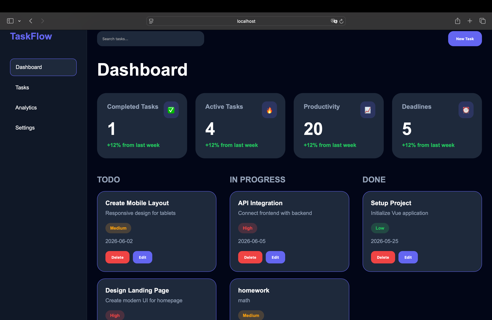

# TaskFlow Dashboard

Modern task management dashboard built with Vue 3.

## 🚀 Features

- Drag & Drop Kanban Board
- Task Management System
- Analytics Dashboard
- Dark / Light Theme
- Multi Language Support
- Responsive Design
- Local Storage Persistence
- Real-time Statistics
- Deadlines Management

---

## 🛠 Tech Stack

- Vue 3
- Vue Router
- Pinia
- VueDraggable
- Chart.js
- Vite

---

## 📸 Screenshots

### Dashboard



---

## ⚡ Installation

Clone repository:

```bash
git clone https://github.com/SzymekK-lab/taskflow-dashboard.git
```

Install dependencies:

```bash
npm install
```

Run application:

```bash
npm run dev
```

Build production version:

```bash
npm run build
```

---

## 🌐 Live Demo

Coming soon...

---

## 📚 What I Learned

- State management with Pinia
- Vue Router
- Drag & Drop systems
- Reactive analytics
- Theme systems
- Localization
- Advanced component architecture

---

## 👨‍💻 Author

Szymek Kaletka
